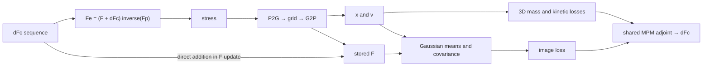

# Gradient flow audit after rollback

Date: 2026-09-14. Local source reference: `eca06f5` on `v3-grid-gs`.

## Status and scope

All changes from the preceding implementation attempt were reverted: 15 tracked
files restored and 17 newly created files moved into
`output/backups/rejected_control_20260914/`. That directory contains a complete
archive and a file manifest. Previous results remain in `output/`.

The server was restored to its own pre-task backup,
`~/physmorph_v2/output/backups/pre_control_20260914_0955.tgz`, and all 93 regular
files were checked against that archive. Replaced server trees were preserved in
`output/backups/rejected_tree_20260914/`. Our previous experiment/viewer processes
and local forwarding helpers were stopped. No other user's jobs were touched.

The original server snapshot is **not identical** to local `eca06f5`: its optimizer
and Gaussian loss hashes differ, while the MPM kernel hash agrees. Therefore the
new numerical audit runs from an isolated `git archive` of `eca06f5` at
`~/physmorph_v2/output/gradient_audit_20260914/`. It does not overwrite the restored
server pipeline. Result JSON records source hashes and discretization.

Only this report and `scripts/probes/audit_gradient_flow.py` are new source files.
The audit performs forward/adjoint evaluations and finite differences, with no
optimization, new animation, parameter fitting, or production fixes.

## Main conclusion

The ordinary Python/Warp image-to-control graph is connected. However, a connected
graph does not establish that image improvement is produced by physical material
transport. Stored F has a direct control-dependent update, and rendering uses that
same F for covariance and child offsets. This permits image changes without
particle-center motion. There is also an optional Python branch that drops the F
covector, several C++ source adjoint discrepancies, and a measurable finite-
difference mismatch in the rendering-plus-image-loss segment at the 12k state.

The next implementation decision should establish the meanings and derivatives
of the state variables before changing gradient weights or the optimizer.

## The actual shared graph

Let `c[t,p] = dFc[t,p]`. The optimization has one shared rollout, rather than two
independent physics/render simulators:



For a terminal rendering loss, the control derivative is

\[
g_c^{render} = J_x^T g_x^{render} + J_F^T g_F^{render},
\qquad J_x=\frac{\partial x_T}{\partial c},\quad
J_F=\frac{\partial F_T}{\partial c}.
\]

For the simple physical objective measured here,

\[
g_c^{phys}=J_x^T g_x^{mass}+J_v^T g_v^{kin}+g_c^{control}.
\]

The code's term named "physics loss" includes target-shape supervision, especially
mass matching. It is not the elastic potential energy or a force. Physical
equations are enforced through the forward rollout itself. Comparing an image
covector directly to stress or force is therefore not the relevant norm test.
Compare objective derivatives with respect to the same `dFc` entries.

Source trace:

- `mpm/kernels.py:40`: effective elastic deformation and PK1 stress.
- `mpm/kernels.py:82`: stress impulse, proportional to dt, in P2G.
- `mpm/kernels.py:184`: controlled F transport in G2P.
- `mpm/kernels.py:196`: F smoothing; `:197`: position advection.
- `mpm/function.py:62`: independent control leaf per time step.
- `mpm/function.py:86`: endpoint x, F, v covectors seed the Warp tape.
- `pipeline/gauss_loss.py:35`: differentiable covariance `sigma0^2 F F^T`.
- `render/children.py:92`: fixed material offsets rendered at `x + F delta`.
- `pipeline/optimizer.py:334`: the common differentiable rollout.

Paths above are relative to `physmorph/`. The terminal tensors are cloned in the
custom autograd forward, but its explicit backward reconnects all three outputs.
The clone is not, by itself, a graph break. Target-image detachment is intentional:
target observations are constants.

## Finding 1: F provides a route that does not require center motion

The implemented forward step, in both Python/Warp and C++ source, is

\[
A=I+\Delta t C_{t+1},\qquad
F_{t+1}=(1-s)A(F_t+c_t)+sF_t,\qquad
x_{t+1}=x_t+\Delta t v_{t+1}.
\]

At dt=0 this becomes `F_next = F + (1-s)c` while x stays fixed. At zero stiffness,
zero initial velocity and zero external force, a positive-dt example has the same
behavior: centers remain fixed and the F-based image still changes. These are
diagnostic limiting cases, not proposed production settings.

Measured with N=256, one step, s=.955, dx=.75, 16^3 grid, four views at 128 pixels,
one Gaussian per selected surface parent, sigma0=.16:

| Diagnostic | Max center change | Max F change | Image loss before → after |
|---|---:|---:|---:|
| dt=0, lambda=800, mu=400 | 0 | .00450003 | .07153484 → .07147551 |
| dt=1/120, lambda=mu=0 | 0 | .00450003 | .07153484 → .07147551 |

The prescribed diagnostic perturbation is `c_xx=.1` for every particle. Velocity
is zero in both cases. The image-control gradient norm is nonzero, .000627354.
Thus the image can improve without stress-mediated transport. This is a property
of the model, not evidence that the ordinary Warp derivative is incorrect.

For a single step from rest, the center response to a stress perturbation contains
both the force integration dt and the position integration dt. The direct F route
contains `(1-s)` without those two factors. This does not predict a universal norm
ratio: material stiffness, density, grid transfers, horizon and observations also
matter. It does show why the two routes must be measured separately.

This route is not proven to dominate the actual 12k initial example: its F-path
control norm is only about 3.65% of the full image-control norm there. It remains
a semantic problem even when its contribution is small at one state.

## Finding 2: optional smoothing drops the F contribution

`pipeline/optimizer.py:547-553` retrieves only `dL_render/dx` and propagates only
the x seed through MPM. When Gaussian covariance or child offsets depend on F,
the `J_F^T g_F` contribution is absent. Smoothing the x field does not recreate it.

This is conditional: `render_gs_iters=0` in the dataclass default. The basic
`render_full_gauss` CLI arm does not automatically enable this branch. A run's
actual config must be checked before attributing its behavior to this defect.

The audit reproduces the original branch using its unmodified smoothing function.
For the N=256/T=3 parent128 case below, the missing F-path norm is .00105803; it is
56.67% of the norm of the two-seed, x-smoothed pullback. With four children at
384 actual pixels, the analogous ratio is 42.25%. These ratios are vector-error
norms, not percentages of physical energy or predicted loss improvement.

## Finding 3: surface observations do not imply surface-only control

The original Gaussian renderer can restrict endpoint observations to selected
surface particles. In the N=256/T=3 case, both endpoint interior covectors are
exactly zero. Nevertheless, the norm of interior entries of `dL_render/ddFc`
is .000662394, versus .00130864 for the full derivative: a ratio of .5062.

That is expected from an MPM Jacobian coupling neighboring particles through shared
grid nodes. It is not itself an adjoint error. The user's desired restriction is
on the **render contribution to the control update**, which is an additional
constraint; the original code does not enforce it after the pullback.

There are two further scope issues:

- The original hybrid silhouette branch observes the full cloud
  (`optimizer.py:310`), and target silhouettes are also baked from the full cloud
  (`runner.py:75`), even when the Gaussian branch is surface-only.
- Endpoint smoothing can spread a masked surface seed into interior particles
  before the MPM pullback (`optimizer.py:550`); it is not remasked there.

Interior particles responding to a surface actuation through physical stress
should remain possible. Restricting control entries is different from preventing
that physical response.

## Finding 4: reductions, covariance observability, and scale

The original objectives use different numerical conventions:

| Term | Reduction | Direct endpoint dependency |
|---|---|---|
| D_vol | Sum of squared log-mass discrepancies over grid cells | x |
| Silhouette | Mean over pixels and cameras | x |
| Gaussian L1 | Mean over RGB pixels and cameras | x, F |
| Kinetic penalty | Mean over particles of squared speed | v |
| Control penalty | Sum of matrix entries divided by T*N | dFc |

See `losses/volumetric.py:357`, `pipeline/render_loss.py:36`,
`pipeline/gauss_loss.py:209`, and `pipeline/optimizer.py:371`.

For the small 16^3-loss-grid, four-view 128-pixel example, changing D_vol from sum
to grid mean changes its derivative by exactly 4096. Changing Gaussian L1 from
its current mean to a sum over every view and RGB pixel changes it by 196608.
Those algebraic factors are diagnostics, **not recommended gains**. Dividing by
all mostly empty grid cells is not automatically a well-defined physical measure.

Nor does image averaging imply that doubling image resolution divides the final
control gradient by four: the number of contributing pixels changes too.
Visibility, footprint size and discretization affect that derivative.

The covariance map itself has an unobservable subspace:

\[
d\Sigma=\sigma_0^2(dF F^T+F dF^T).
\]

At F=I, skew-symmetric perturbations produce no covariance change. An isotropic
parent Gaussian therefore cannot observe every F component through covariance.
Child offsets introduce an additional F-dependent mean route. A scalar cannot
recover missing information or distinguish cancellation of different routes.

The small example has a negative cosine (-.3450) between the position-route and
F-route image-control derivatives. The 12k initial example has a nearly zero
cosine (.00462). Norm comparison alone hides this directional structure.

The original EMA norm balancer (`render_loss.py:169`) is active only when rendering
is enabled, estimates its coefficient at the first iteration of each window,
and uses the processed render direction. Its reported "raw" gradient can already
have been smoothed or masked (`optimizer.py:568`). This is insufficient telemetry
to locate attenuation in the original chain.

## Numerical evidence and limits

All rollout evaluations were on hyde06. The local CPU/warp-CPU test suite passed:
**128 tests, 3 warnings**, 26.11 seconds. No production file was changed to make
those tests pass. Existing tests do not rule out the conditional issues above.

The isolated audit uses fixed starting controls sampled with standard deviation
.001; no objective optimization or line search is executed.

| Case | N / T | dt / dx / MPM grid | Loss grid | Gaussian pixels / views / children | Physical-core norm / image norm |
|---|---|---|---|---|---:|
| Synthetic parent | 256 / 3 | 1/120 / .75 / 16^3 | 16^3, dx=.75 | 128 / 4 / 1 | 40.0797 |
| Synthetic children | 256 / 3 | 1/120 / .75 / 16^3 | 16^3, dx=.75 | **384 actual**, 512 requested / 4 / 4 | 34.6302 |
| Source sphere → bunny initial state | 12000 / 20 | 1/240 / .5 / 64^3 | 48^3, dx=2/3 | **160 actual**, 128 requested / 6 / 1 | 10914.84 |

All cases use mass per particle 1, s=.955 and drag=.9. The synthetic material is
lambda=800, mu=400, sigma0=.16; the 12k case uses E=140000, nu=.2, hence
lambda=38888.89 and mu=58333.33, with sigma0=.10087396. Surface membership is fixed
from the rest cloud: 105/256 or 3657/12000 parents. Small-case extent=1.8; the 12k
extent is 5.1179886. Four-child sigma is .55 times the listed parent sigma.

The measured physical core is exactly `D_vol + 20*mean(|v|^2) +
.001*sum(|dFc|^2)/(T*N)`. It excludes H^-1 and other cleanup/prior terms. The
12k audit reads only source/target arrays from the earlier experiment archive;
it does not reuse its optimized trajectory or its reverted optimizer.

For the 12k initial state:

| Derivative with respect to the same dFc sequence | L2 norm |
|---|---:|
| D_vol | 26.94053 |
| Physical core described above | 26.94398 |
| Full-cloud silhouette | .00764676 |
| Surface Gaussian L1 | .00246856 |
| Gaussian through x only | .00246650 |
| Gaussian through F only | .000090217 |

This establishes scale disparity in a reproducible case, not a fixed "correct"
ratio or an explanation of every earlier run's reported 1000x discrepancy.

For each synthetic case, three high-signal control entries were checked for both
D_vol and Gaussian loss, with central-difference epsilon .001, .003 and .01.
Every selected entry had at least two estimates below 8% relative error. Chain
decomposition and repeated-backward relative differences were on the order of
1e-5 to 1e-4. These are limited float32 checks of selected entries, not proof of
the entire Jacobian, contact derivatives, or gradients near singular F.

At N=12000, the selected mass entry passed that criterion. The selected image
entry **did not**: relative errors were 34.34%, 19.42% and 7.66%. The image scalar
has weak single-entry finite-difference signal; this failure is retained rather
than labeled a pass. A separate directional/replay probe records whether a
larger aggregate perturbation resolves the discrepancy; its measurements are
stored separately and do not erase this failed check.

The follow-up isolation uses the **same 12k state and discretization** and freezes
the terminal image covectors. It differentiates the linear terminal functional
`<gx, x-x_ref> + <gF, F-F_ref>` through MPM, eliminating changes in raster visibility
and the image loss. For unit control directions derived from the full render,
x-path, and F-path gradients, and L2 perturbation .005/.02/.05:

| Check | Observed relative-error range |
|---|---:|
| Full rendering loss along the full image-control direction | 7.52–8.16% |
| Full rendering loss along the F-path-derived control direction | 11.62–16.85% |
| Fixed image covector through MPM, all nine direction/epsilon pairs | Below .04% |
| Rendering plus L1 loss, position endpoint perturbations | 5.00–7.49% |
| Rendering plus L1 loss, F endpoint perturbations | 7.15–8.79% |

The endpoint perturbation norms are .0001/.001/.01. Five identical-
control rendering replays returned the same float32 scalar; some perturbed
replays differed by one scalar ULP. This does **not** support explaining the
remaining discrepancy merely as random rollout noise. In this tested state the
larger mismatch persists in the rendering-plus-loss segment, whereas the MPM pullback of
fixed covectors agrees much more closely.

The script's historical JSON key `renderer_only_endpoint_checks` means MPM is
bypassed; it still evaluates `GaussViews.loss`, including covariance construction
and the absolute-value L1 reduction. It does not isolate the CUDA rasterizer from
those operations. L1 residual sign crossings are another possible source of
nonsmooth finite-difference behavior.

The runtime backend is `diff_gauss` from
`/home/chayo/Shape-morphing-binder-surfmorph/third_party/diff-gaussian-rasterization/`,
using Torch 2.8.0+cu128, Warp 1.16.0, and an RTX 6000 Ada. Its source includes
visibility/alpha cutoffs and early-termination logic. No modification was made to
that checkout or extension. The present audit does not distinguish an analytic
backward defect from finite differences crossing nonsmooth raster decisions or
L1 residual signs. Frozen residual signs, a fixed raster active set, or a smooth
reference comparison are still needed for that distinction. The derivative of
the native rendering-plus-loss segment is **not certified correct**; the audit
does not identify a CUDA backward bug.

Original high-resolution requests also need caution: `gauss_loss.py:133` caps
actual resolution at 384. This cap was restored with the original code and is
not fixed by the audit.

## C++ source findings: do not copy the adjoint without verification

An independent adversarial review checked the following original source paths.
**The prebuilt C++ extension was not exercised by this audit**, so these are
source/formula findings, not claims that a particular binary produced these
numerical errors.

### Stored F and dFc derivatives differ

For the F update above and terminal covector G, the direct contributions are

\[
g_{F_t}=(1-s)A^T G+sG,\qquad
g_{c_t}=(1-s)A^T G,\qquad
g_{C_{t+1}}=(1-s)\Delta t G(F_t+c_t)^T.
\]

`legacy/DiffMPMLib3D/BackPropagation.cpp:26-27` forms the stored-F derivative
including `sG`. `PointCloud.cpp:108` then uses `dLdF` as the gradient to update
`dFc`. The direct control derivative should not include `sG`.

Separately, `BackPropagation.cpp:30` omits `(1-s)` in its F-to-C contribution.
The forward smoothing is explicit in `ForwardSimulation.cpp:124`.

An isolated double-precision calculation of these source formulas, at dt=1/240
and s=.955, reproduces a C-adjoint magnitude ratio of **22.2222** and a ratio
of about **22.2191** when the stored-F derivative is used as the direct control
derivative. Those numbers concern this isolated update, not the complete C++
trajectory gradient. The Warp tape differentiates its written forward update;
these C++ manual-adjoint defects should not be attributed to Warp by association.

### Other C++ injection and scalar inconsistencies

| Finding | Evidence | Scope and consequence |
|---|---|---|
| Out-of-target multiplier appears in the derivative only | `CompGraph.cpp:70-78`, `:105-106` | Ordinary mass-loss derivative is not the derivative of its returned scalar; multiplier is 5 in this source. |
| Render covectors are injected, but acceptance uses mass loss | `CompGraph.cpp:160`, `:167`, `:299`, `:436-438` | With rendering enabled, an accepted update does not establish improvement of a fresh joint image-plus-mass objective. |
| Render callback precedes the multi-update optimizer | `E2ESession.cpp:71`, `:99` | Rendering covectors can become stale within that optimization call. |
| `physics_weight` scales already combined adjoints each reverse step | `CompGraph.cpp:203-215` | It affects rendering too, with horizon-dependent scaling. Disabled at its default value 1. |
| Reported control-layer "physics" norm can include render injection | `CompGraph.cpp:303-305` | It is not an isolated physical norm if injection is active. |
| Direct accumulation copies row-major data into Eigen storage | `legacy/bind/bind.cpp:603-608`, `pch.h:24` | With the source's ordinary column-major Matrix3f layout, nonsymmetric F covectors transpose. The indexed stored-gradient hook avoids this specific layout issue. |
| Direct accumulation can be cleared before use | `CompGraph.cpp:85`, `:109-111` | Mass-loss initialization clears terminal adjoints. Hook call order matters. |

These review findings are accepted as audit issues and deliberately left unfixed
in this analysis-only change. Whether the installed binary matches this source
must be established before numerical C++/Warp parity is claimed.

## Boundaries of differentiation and what to establish next

The differentiable window is T steps. The committed state and plastic
assimilation are NumPy operations outside that window (`runner.py:301-357`;
`optimizer.py:750`). Render-driven changes can affect later windows through the
new state/Fp, but gradients are not backpropagated through all previous commits
and assimilation operations. Calling this full-animation backpropagation would
be inaccurate.

The mathematical decisions to settle before another optimizer implementation are:

1. Whether rendering should use the currently controlled/smoothed F or a
   deformation field that measures transport of material geometry. Identify the
   allowed direct control route explicitly; test it at zero stiffness.
2. What the joint scalar objective and allowed surface-control subspace are.
   Every search direction and acceptance derivative must refer to that contract.
3. Which C++ snapshot/binary defines the reference, and whether its own
   finite-difference adjoint checks pass before it is used to correct Python.
4. How norms change across endpoint and control spaces, time layers, and
   x/F/v routes at matched states and discretizations. Resolve numerical
   finite-difference noise before interpreting small components.

No alternating optimizer, large scalar render gain, PCGrad modification,
surface-binding change, or VBD implementation is proposed as a fix in this audit.

## Reproduction and artifacts

Run only on hyde06, from the isolated baseline archive containing the audit script:

```bash
export CUDA_VISIBLE_DEVICES=0 OMP_NUM_THREADS=4 MKL_NUM_THREADS=4 OPENBLAS_NUM_THREADS=4
PY=/home/chayo/miniforge3/envs/diffmpm_v2.3.0/bin/python
$PY scripts/probes/audit_gradient_flow.py --out parent128.json
$PY scripts/probes/audit_gradient_flow.py --children 4 --res 512 --out children_requested512.json
$PY scripts/probes/audit_gradient_flow.py \
  --initial_archive ../control_gauss_surface_20260914_control_gauss.npz \
  --fd_entries 1 --out initial12000.json
$PY scripts/probes/audit_gradient_flow.py \
  --initial_archive ../control_gauss_surface_20260914_control_gauss.npz \
  --fd_entries 0 --directional --out initial12000_directional.json
```

Local measurement copies: `output/gradient_audit_parent128.json`,
`output/gradient_audit_children_requested512.json`,
`output/gradient_audit_initial12000.json`, and
`output/gradient_audit_initial12000_directional.json`. The follow-up including
fixed-covector MPM and renderer-only isolation is
`output/gradient_audit_initial12000_isolated.json`; it uses the final version of
the script with the last command above (change `--out` to retain both records).

Provenance qualification from adversarial review: the earlier probe revisions
were not separately archived, and the original JSONs did not record an extension
binary hash. The exact script for the final isolated measurement is preserved as
`output/gradient_audit_probe_isolated.py`, SHA256
`6ada9a51ee78464e42ebc1d9c9e012ab2ff2403d800fd03d81f3fdefd5848650`.
The retrospective inventory `output/gradient_audit_provenance_20260914.json`
identifies the installed extension and hashes the measurements; its binary hash
was collected after the runs and is not an at-run attestation. The final probe
now records its own hash, the raster wrapper/extension hashes, and every Python
source file under `physmorph` for subsequent evaluations. This limitation does
not change the reported measurements, but exact historical backend reproduction
is not guaranteed.
